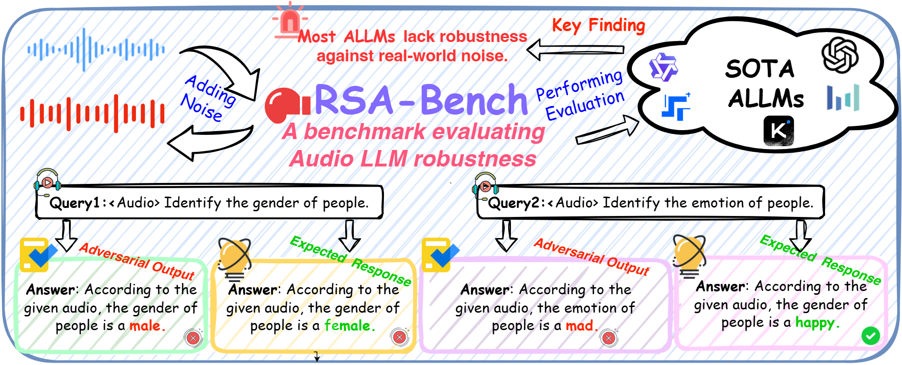

# RSA-Bench

## Abstract

While Audio Large Models (ALLMs) have achieved remarkable proficiency, their robustness remains brittle in real-world deployment. Existing evaluations largely rely on synthetic Gaussian noise or simplistic single-source interference, failing to capture the intricate, multi-layered acoustic dynamics—or **Acoustic Ecology**—that characterize authentic physical environments. To bridge this ecological gap, we introduce **RSA-Bench**, a comprehensive robustness benchmark designed to stress-test ALLMs through high-fidelity auditory scene simulations. Unlike traditional methods, we construct evaluation samples by naturally superimposing diverse environmental soundscapes—spanning *Pasture*, *Extreme Weather*, *Classroom*, and *Outdoors*—onto clean speech signals across a spectrum of interference intensities. By evaluating models on six core tasks ranging from fundamental perception to complex reasoning, our study unveils three macro-level insights: **(1) The Perception–Cognition Gap**: Models maintain relative resilience in low-level recognition but suffer a **functional collapse** in high-order reasoning tasks under stress; **(2) Scenario Sensitivity**: “Vocal-like” interference (e.g., background laughter) proves significantly more destructive than mechanical noise, challenging the model’s auditory attention mechanisms; and **(3) The Denoising Paradox**: Standard speech enhancement often exacerbates performance degradation, as ALLMs prove highly sensitive to the semantic distortions introduced by denoising artifacts.

